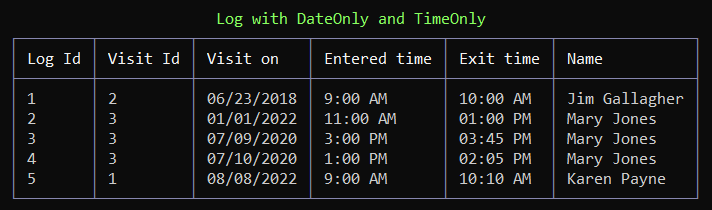

# About

With .NET Core 7, TimeOnly added [microseconds](https://learn.microsoft.com/en-us/dotnet/api/system.timeonly.microsecond?view=net-7.0#system-timeonly-microsecond) and [nanosecond](https://learn.microsoft.com/en-us/dotnet/api/system.timeonly.nanosecond?view=net-7.0) properties.

# Working with or Microsoft.Data.SqlClient DataReader

Microsoft.Data.SqlClient 5.1.0-preview2.22314.2 [released](https://github.com/dotnet/SqlClient/blob/main/release-notes/5.1/5.1.0-preview2.md) 10 November 2022

Added support for `DateOnly` and `TimeOnly` for `SqlParameter` value and `GetFieldValue`


<br>

```csharp
internal static class Extensions
{

    public static DateOnly GetDateOnly(this SqlDataReader reader, int index)
        => reader.GetFieldValue<DateOnly>(index);

    public static string GetDateOnlyFormatted(this SqlDataReader reader, int index)
        => reader.GetFieldValue<DateOnly>(index).ToString("MM/dd/yyyy");

    public static TimeOnly GetTimeOnly(this SqlDataReader reader, int index)
        => reader.GetFieldValue<TimeOnly>(index);

    public static string GetTimeOnlyFormatted(this SqlDataReader reader, int index)
        => reader.GetFieldValue<TimeOnly>(index).ToString("hh:mm tt");
}
```

<br>

```csharp
public static async Task Read()
{
    Helpers.PrintSampleName();
    var statement =
        "SELECT L.VistorLogIdentifier, L.VisitorIdentifier, L.VisitOn, L.EnteredTime, L.ExitedTime,  V.FirstName + ' ' + V.LastName Fullname " + 
        "FROM dbo.VisitorLog AS L INNER JOIN dbo.Visitor AS V ON L.VisitorIdentifier = V.VisitorIdentifier;";

    await using var cn = new SqlConnection(ConfigurationHelper.ConnectionString());
    await using var cmd = new SqlCommand { Connection = cn, CommandText = statement };

    await cn.OpenAsync();
    await using var reader = await cmd.ExecuteReaderAsync();

    var table = CreateTable();
    while (reader.Read())
    {
        table.AddRow(
            reader.GetInt32(0).ToString(),
            reader.GetInt32(1).ToString(),
            reader.GetDateOnlyFormatted(2).ToString(), 
            reader.GetTimeOnly(3).ToString(),
            reader.GetTimeOnlyFormatted(4),
            reader.GetString(5)
        );
    }

    AnsiConsole.Write(table);
}
```


