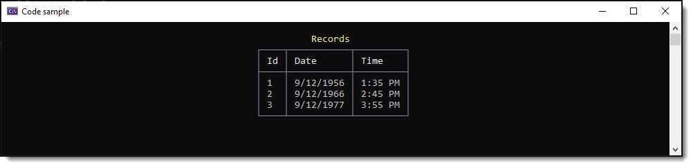

# Serialoze/deserialize DateOnly/TimeOnly

Simple example using customer converters, `DateOnlyConverter` and `TimeOnlyConverter` located in the folder `Converters`. The converters are also in the class project `EntityCoreTimeDateUtilities`.





```csharp
public class Container
{
    public int Id { get; set; }
    public TimeOnly TimeOnly { get; set; }
    public DateOnly BirthDate { get; set; }
}
```