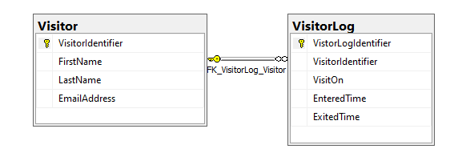
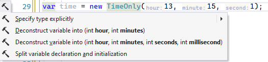
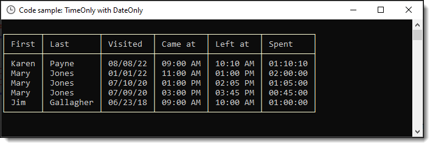

# EF Core: Working with TimeOnly

A `TimeOnly` is ideal for scenarios such as recurring meeting times, daily alarm clock times, or the times that a business opens and closes each day of the week. Because a `TimeOnly` isn’t associated with any particular date, it is best visualized as a circular analog clock that might hang on your wall (albeit a 24-hour clock, not a 12-hour clock). 

In this article learn how to use `TimeOnly` along with `DateOnly` (which I wrote another [article](https://github.com/karenpayneoregon/dateonly-primer) on recently) with Entity Framework Core 6 and higher.

In the prior article a person model was used focusing on DateOnly.

```csharp
public partial class Person
{
    public int PersonId { get; set; }
    public string FirstName { get; set; }
    public string LastName { get; set; }
    public DateOnly? BirthDate { get; set; } // see DbContext, ConfigureConventions
}
```

In this article, there are two models. The idea is when someone visits a place they sign in with their name, email and time entered than when leaving record the time they left.

In SQL-Server 

Where VisitOn is type date and EnteredTime and ExitedTime are type time(7).



In the models

```csharp
public partial class Visitor
{
    public Visitor()
    {
        VisitorLog = new HashSet<VisitorLog>();
    }

    public int VisitorIdentifier { get; set; }
    public string FirstName { get; set; }
    public string LastName { get; set; }
    public string EmailAddress { get; set; }
    public virtual ICollection<VisitorLog> VisitorLog { get; set; }
    public override string ToString() => $"{VisitorIdentifier,-4} {FirstName} {LastName}";
}
```
</br>

```csharp
public partial class VisitorLog
{
    public int VistorLogIdentifier { get; set; }
    public int? VisitorIdentifier { get; set; }
    public DateOnly? VisitOn { get; set; }
    public TimeSpan? EnteredTime { get; set; }
    public TimeSpan? ExitedTime { get; set; }
    public TimeSpan Spent => EnteredTime.Elapsed(ExitedTime);
    public virtual Visitor Navigation { get; set; }
    public override string ToString() => $"{VistorLogIdentifier,-4}{VisitorIdentifier}";
}
```

The code `EnteredTime.Elapsed(ExitedTime)` uses an extension method to provide elasped time or better yet time spent

```csharp
public static TimeSpan Elapsed(this TimeSpan? startTime, TimeSpan? endTimeSpan)
    => new (endTimeSpan!.Value.Ticks - startTime!.Value.Ticks);
```

There is a version for TimeSpan also.

```csharp
public static TimeSpan Elapsed(this TimeSpan startTime, TimeSpan endTimeSpan)
        => new(endTimeSpan.Ticks - startTime.Ticks);
```


In the DbContext we add the converters (coming up below)

```csharp
protected override void ConfigureConventions(ModelConfigurationBuilder builder)
{

    builder.Properties<DateOnly>()
        .HaveConversion<DateOnlyConverter>()
        .HaveColumnType("date");

    builder.Properties<TimeOnly>()
        .HaveConversion<TimeOnlyConverter>()
        .HaveColumnType("time");

    base.ConfigureConventions(builder);

}
```

## Converters

They are placed in another class project so readers can copy the class project to their Visual Studio solution,

```csharp
namespace EntityCoreTimeDateUtilities.Classes;

public class DateOnlyConverter : ValueConverter<DateOnly, DateTime>
{
    public DateOnlyConverter() 
        : base(dateOnly => 
                dateOnly.ToDateTime(TimeOnly.MinValue), 
            dateTime => DateOnly.FromDateTime(dateTime)) { }
}
```

</br>

```csharp
namespace EntityCoreTimeDateUtilities.Classes;

public class TimeOnlyConverter : ValueConverter<TimeOnly, TimeSpan>
{
    public TimeOnlyConverter() : base(timeOnly => 
            timeOnly.ToTimeSpan(), 
        timeSpan => TimeOnly.FromTimeSpan(timeSpan)) { }
}
```

## Reading data

Reading data is no different than how one reads data with EF Core, here it's done in a console project in a class.

```csharp
namespace VisitorsConsoleApp.Classes;

internal class DataOperations
{
    public static List<VisitorLog> DescendingLogs()
    {
        using var context = new VisitorContext();
        return context.VisitorLog
            .Include(x => x.Navigation)
            .OrderByDescending(x => x.VisitOn!.Value)
            .ToList();
    }
}
```

Then call the above method

```csharp
internal partial class Program
{
    static void Main(string[] args)
    {
        var table = CreateViewTable();

        List<VisitorLog> logs = DataOperations.DescendingLogs();
        foreach (var log in logs)
        {

            table.AddRow(
                log.Navigation.FirstName, 
                log.Navigation.LastName, 
                log.VisitOn!.Value.Formatted(), 
                log.EnteredTime!.Value.Formatted(), 
                log.ExitedTime!.Value.Formatted(),
                log.Spent.ToString());

        }

        AnsiConsole.Write(table);
        Console.ReadLine();
    }
}
```

## Deconstruct

To make life easier for obtaining parts of a DateOnly and TimeOnly I created the following extensions.

For more on Deconstruct, see the following article/code sample [The art of Deconstructing](https://github.com/karenpayneoregon/deconstructing-samples).


```csharp
internal static class DeconstructExtensions
{
    public static void Deconstruct(this DateOnly date, out int day, out int month, out int year) =>
        (day, month, year) = (date.Day, date.Month, date.Year);


    public static void Deconstruct(this TimeOnly sender, out int hour, out int minutes, out int seconds, out int millisecond) =>
        (hour, minutes, seconds, millisecond) = (sender.Hour, sender.Minute, sender.Second, sender.Millisecond);

    public static void Deconstruct(this TimeOnly sender, out int hour, out int minutes) =>
        (hour, minutes) = (sender.Hour, sender.Minute);
}
```

Conventional method to get hour and minutes from a TimeSpan.

```csharp
var timeSpan = new TimeOnly(13, 15, 1);
Console.WriteLine($"{timeSpan.Hour}:{timeSpan.Minute}");
```

Using Deconstruct which personally is clearer and you don't need to write this all out, simply create a TimeOnly as per above and Visual Studio will offer to do the work for you.



```csharp
var (hour, minutes) = new TimeOnly(13, 15, 1);
Console.WriteLine($"{hour}:{minutes}");
```

## Format TimeOnly

Using an extension method

```csharp
namespace VisitorsConsoleApp.Extensions;

public static class TimeSpanExtensions
{
    /// <summary>
    /// Format with hh:mm tt
    /// </summary>
    public static string Formatted(this TimeSpan sender, string format = "hh:mm tt")
        => DateTime.Today.Add(sender).ToString(format);

}
```

Usage, taken from code in Program Main shown above and the results are shown in the image below.

```csharp
log.ExitedTime!.Value.Formatted()
```


<table>
	<tr>
		<td></td>
		<td></td>
	</tr>
</table>

# Connection string

In this article/code sample and past article/code samples I’ve been using a custom NuGet package found [here](https://www.nuget.org/packages/ConfigurationLibrary/1.0.1?_src=template).

Add a appsetting.json file as per below

```json
{
  "ConnectionsConfiguration": {
    "ActiveEnvironment": "Development",
    "Development": "Data Source=.\\SQLEXPRESS;Initial Catalog=TimeOnlyDatabase;Integrated Security=True",
    "Stage": "Stage connection string goes here",
    "Production": "Prod connection string goes here"
  }
}
```

In the above case there are three connection strings (only one used). If there were three one can toggle between them by setting ActiveEnvironment to one of the three environments.

In the DbContext


```csharp
protected override void OnConfiguring(DbContextOptionsBuilder optionsBuilder)
{
    if (!optionsBuilder.IsConfigured)
    {
        optionsBuilder.UseSqlServer(ConfigurationHelper.ConnectionString());
    }
}
```


# Summary

There is repetition between this article and the following article although this is not a bad thing, you the read have an opportunity to see different ways to use DateOnly and TimeOnly.

There is a chance there will be a built-in converter in EF Core 7 but that is not a given so between this article the former article and the Deconstruct you have the building blocks and tools to work with DateOnly and TimeOnly.
