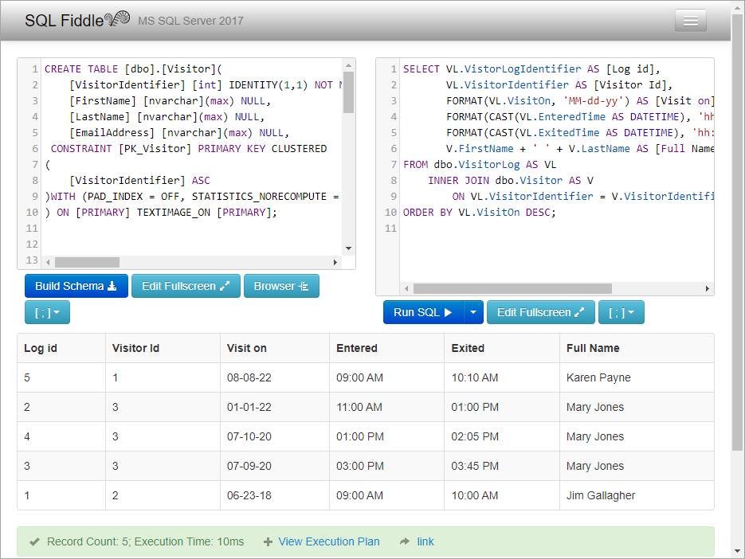

# T-SQL

To get an idea of a mirror image to EF Core I created a [SQL Fiddle](http://sqlfiddle.com/#!18/6cb0c/4) shown below. Using `SqlClient` data provider a developer must perform a conversion as a DataReader does not know about DateOnly or TimeOnly.

```sql
SELECT VL.VistorLogIdentifier AS [Log id],
       VL.VisitorIdentifier AS [Visitor Id],
       FORMAT(VL.VisitOn, 'MM-dd-yy') AS [Visit on],
       FORMAT(CAST(VL.EnteredTime AS DATETIME), 'hh:mm tt') AS [Entered],
       FORMAT(CAST(VL.ExitedTime AS DATETIME), 'hh:mm tt') AS [Exited],
       V.FirstName + ' ' + V.LastName AS [Full Name]
FROM dbo.VisitorLog AS VL
    INNER JOIN dbo.Visitor AS V
        ON VL.VisitorIdentifier = V.VisitorIdentifier
ORDER BY VL.VisitOn DESC;
```

